# Predict-Otron-9000 Architecture Documentation

This document provides comprehensive architectural diagrams for the Predict-Otron-9000 multi-service AI platform, showing all supported configurations and deployment patterns.

## Table of Contents

- [System Overview](#system-overview)
- [Workspace Structure](#workspace-structure)
- [Deployment Configurations](#deployment-configurations)
  - [Development Mode](#development-mode)
  - [Docker Monolithic](#docker-monolithic)
  - [Kubernetes Microservices](#kubernetes-microservices)
- [Service Interactions](#service-interactions)
- [Platform-Specific Configurations](#platform-specific-configurations)
- [Data Flow Patterns](#data-flow-patterns)

## System Overview

The Predict-Otron-9000 is a comprehensive multi-service AI platform built around local LLM inference, embeddings, and web interfaces. The system supports flexible deployment patterns from monolithic to microservices architectures.

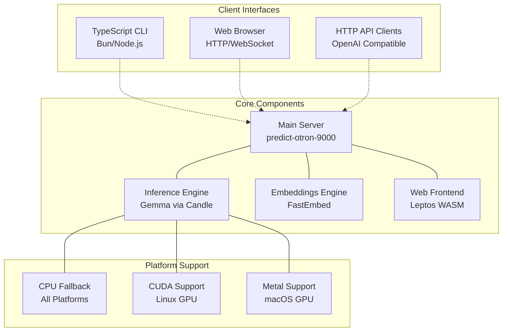

## Workspace Structure

The project uses a 4-crate Rust workspace with TypeScript tooling, designed for maximum flexibility in deployment configurations.

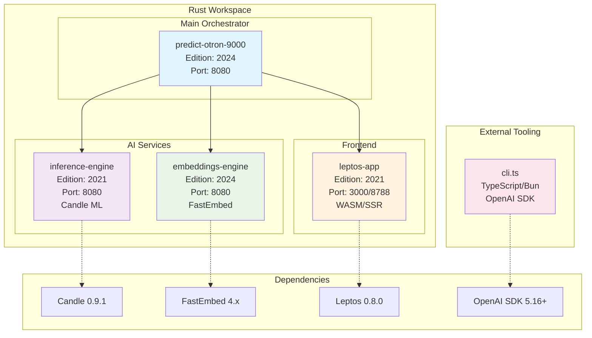

## Deployment Configurations

### Development Mode

Local development runs all services integrated within the main server for simplicity.

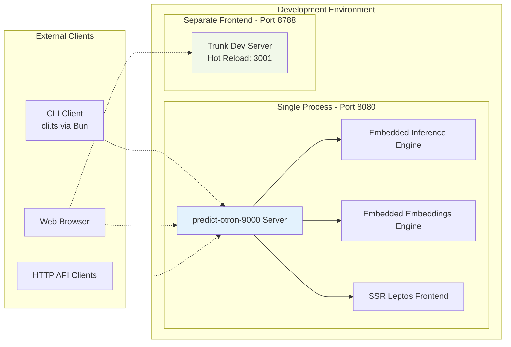

### Docker Monolithic

Docker Compose runs a single containerized service handling all functionality.

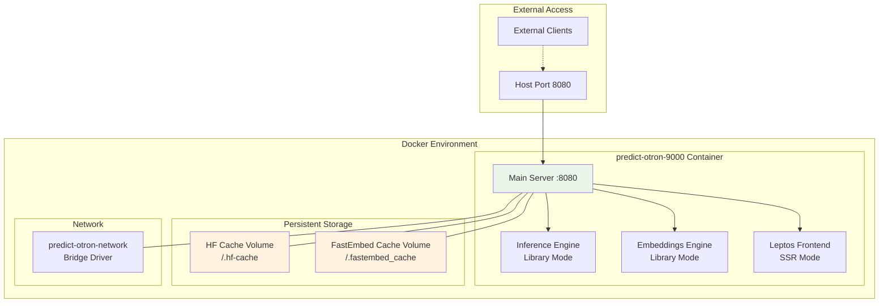

### Kubernetes Microservices

Kubernetes deployment separates all services for horizontal scalability and fault isolation.

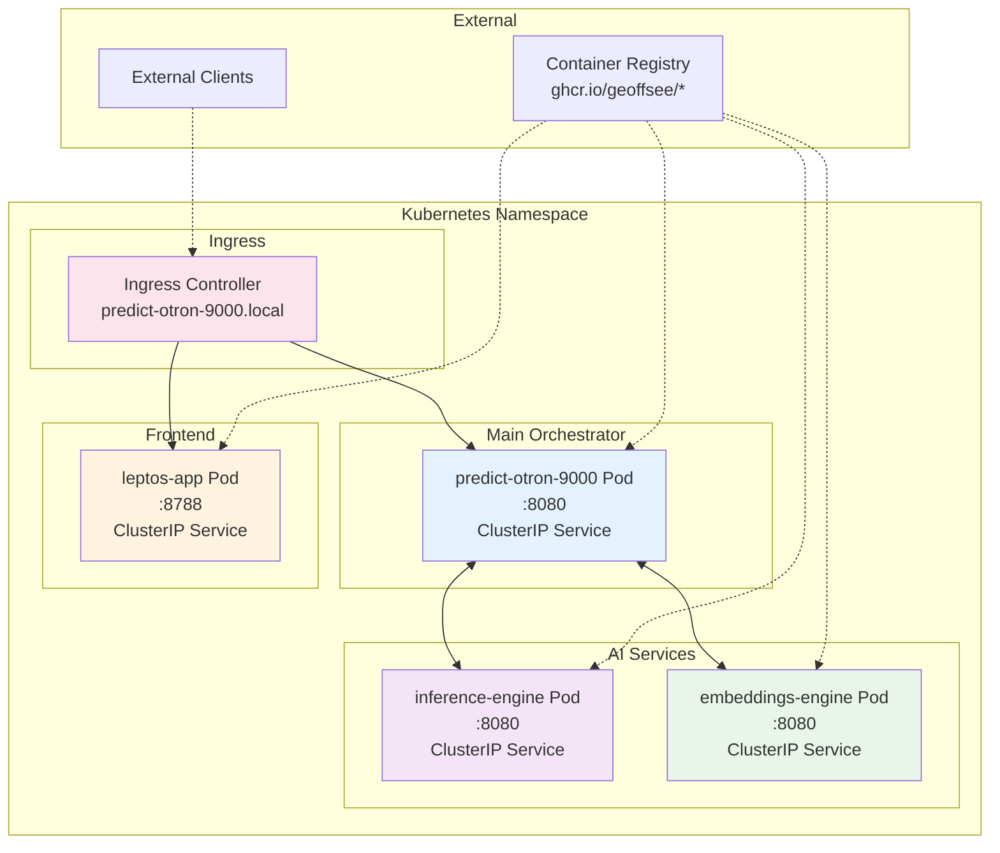

## Service Interactions

### API Flow and Communication Patterns

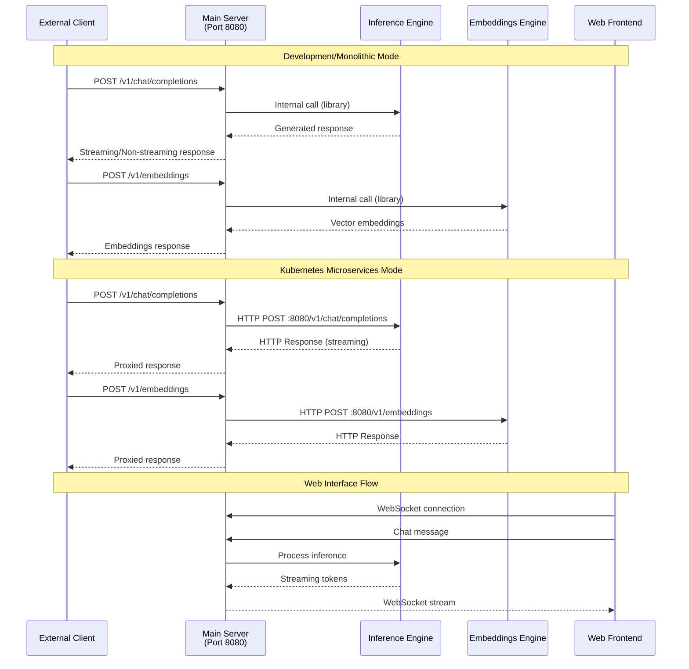

### Port Configuration Matrix

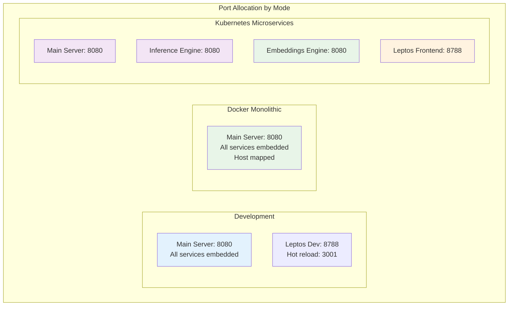

## Platform-Specific Configurations

### Hardware Acceleration Support

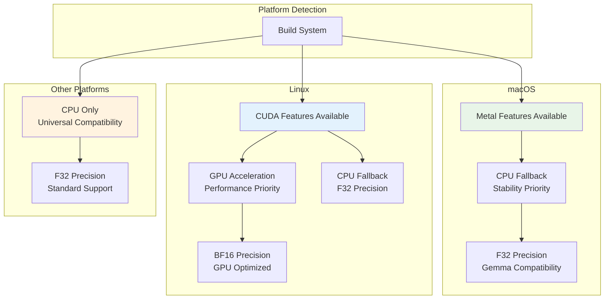

### Model Loading and Caching

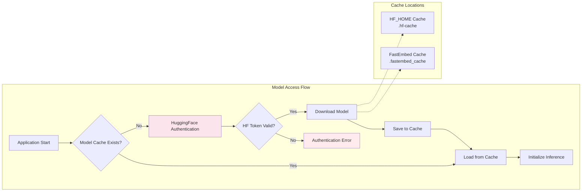

## Data Flow Patterns

### Request Processing Pipeline

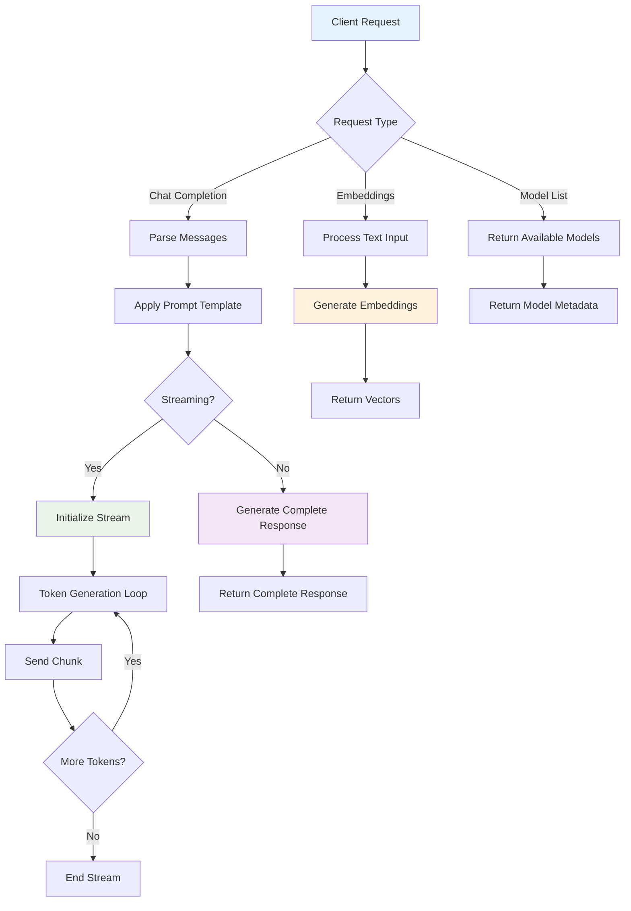

### Authentication and Security Flow

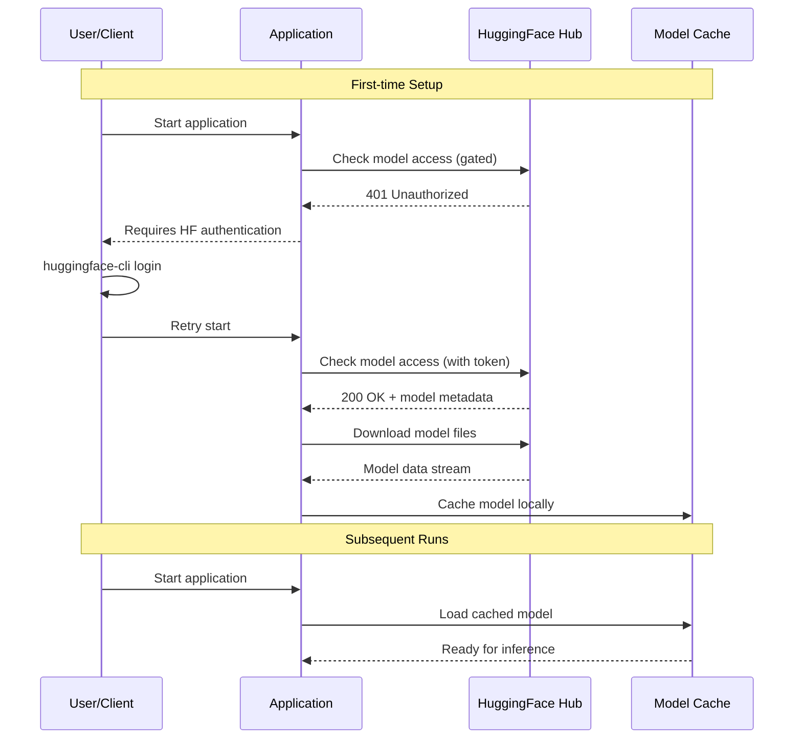

---

## Summary

The Predict-Otron-9000 architecture provides maximum flexibility through:

- **Monolithic Mode**: Single server embedding all services for development and simple deployments
- **Microservices Mode**: Separate services for production scalability and fault isolation
- **Hybrid Capabilities**: Each service can operate as both library and standalone service
- **Platform Optimization**: Conditional compilation for optimal performance across CPU/GPU configurations
- **OpenAI Compatibility**: Standard API interfaces for seamless integration with existing tools

This flexible architecture allows teams to start with simple monolithic deployments and scale to distributed microservices as needs grow, all while maintaining API compatibility and leveraging platform-specific optimizations.